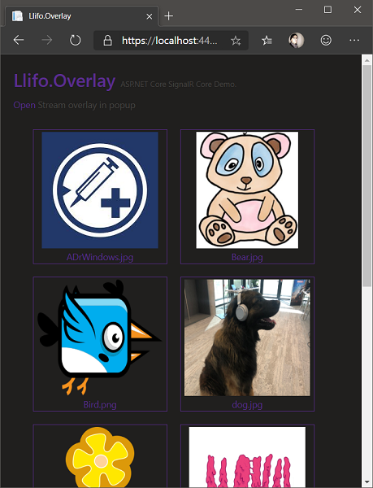
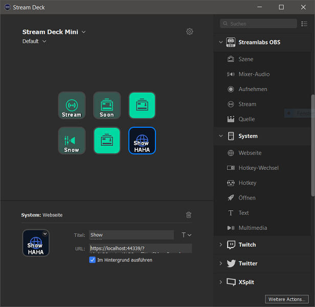
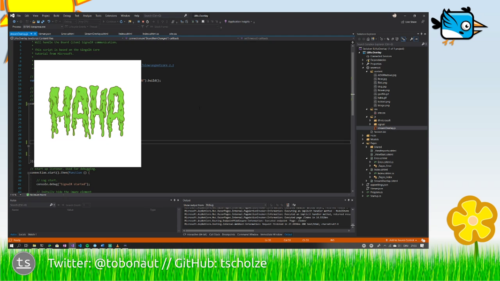

# LLifo.Overlay

> Llifo, welsh for &quot;streaming&quot;, is an local hosted and open source ASP.NET Core Razor app that demonstrate a simple usage of the SignalR functionality.

## Prerequirements
- Mac, Linux, Windows
- Visual Studio or Visual Studio Code
- .NET Core 2.2

## How it looks

At the moment the user interface is only used to test the code behind.

## How it works

The stream overlay image board will use all files from the `wwwroot/content` directory. The communication between the board and the actual overlay web page is realized by using a SignalR Core Hub.
On the reciever side, the SignalR incoming message handling is implemented in a simpel JavaScript file `streamOverlay.js`.  

That means, that you can use every web-request making device to trigger an overlay. For example a browser like seen above or a Elgato StreamDeck button action.

**Keep in mind**
* This not an example app, not meant for production or something more than beginner level

## Usage

1. Clone or download the repository
2. Add image assets to the project's `wwwroot/content`-folder
3. Start the local web server
4. Create a new web view in OBS that points to `https://localhost:44339/StreamOverlay`
5. Use the web view or copy the link behind an board item and paste it to an Elgato Stream deck action
6. Have fun
7. Understand what SignalR can do

## Contributing

Feel free to improve the quality of the code. It would be great to learn more from experienced C#, Razor Page developers.

## Authors

Just me, [Tobi]([https://tscholze.github.io).

## Thanks to

* [chsarpfritz](https://github.com/TwitchLib/TwitchLib) on Twitchand his [Discord](https://discord.gg/RnJhrJq) community
* Microsoft [Office Fabric Web](https://developer.microsoft.com/en-us/fabric#/styles/web) styling.

## License

This project is licensed under the MIT License - see the [LICENSE](LICENSE.md) file for details.
Dependencies or assets maybe licensed differently.